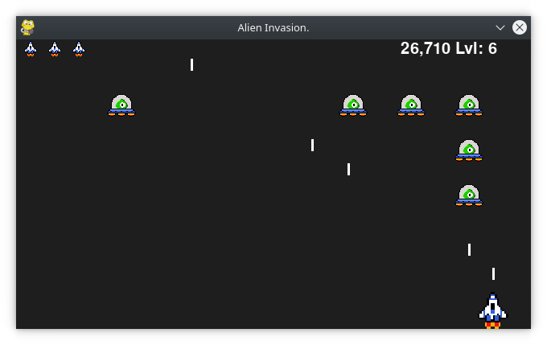
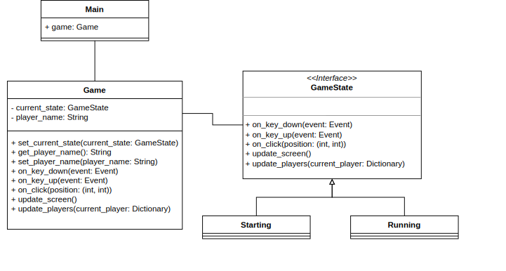

# Alien Invasion Game

This project was inspired by the project in the book *Python Crash Course, A hands-on, Project-Based Introduction to Programming*

## Description of the game proposed in the book

In Alien Invasion, the player controls a rocket ship that appears at the bottom center of the screen. The player can move the ship right and left using the arrow keys and shoot bullets using the spacebar.
When the game begins, a fleet of aliens fills the sky and moves across and down the screen.
The player shoots and destroys the aliens.
If the player shoots all the aliens, a new fleet appears that moves faster than the previous fleet.
If any alien hits the player’s ship or reaches the bottom of the screen, the player loses a ship.
If the player loses three ships, the game ends.

## Description of the alterations made

- An initial screen is shown to the player when the game starts.
On this screen, the five better scores (that are stored in a json file) are displayed.
Moreover, the player may add his/her name.
- Regarding the game's code, some parts of it are the same as the ones shown in the book.
However, I have reformulated the game's code using a design pattern (diagram below).
In this case, it was used the State Pattern, which allows an object to alter its behavior when its internal state changes.
The object will appear to change its class.
- I have created new images for the ship and the alien.

